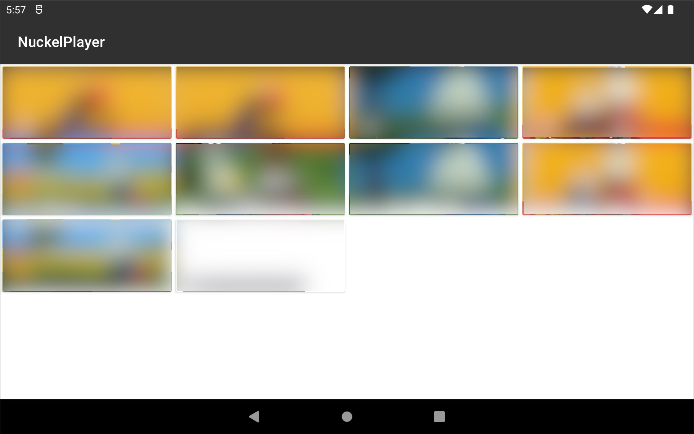
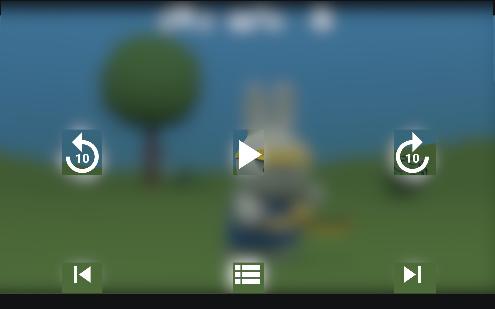

# About

This is a kids friendliy offline video player for Android. It queries Android for all video files
and displays them in a list. The user can select a video and play it. The app is designed to be
used by kids, so it is very simple and easy to use. It doesn't have any settings and anything
else that can be "misconfigured" by kids.
Use it with app pinning and/or a launcher that doesn't allow to exit the app.

Doesn't have any ads, tracking, subscriptions or anything else.

# Screenshots

# Troubleshooting

## Videos do not show after uploading

TL;DR: Reboot your device.

Android keeps an internal media database, which can't be accessed/refreshed and/or modified anymore.
Stock android seem to have a setting/workaround on how this database can be refreshed, but this
is not available on Amazon devices.

# License

Public Domain.

